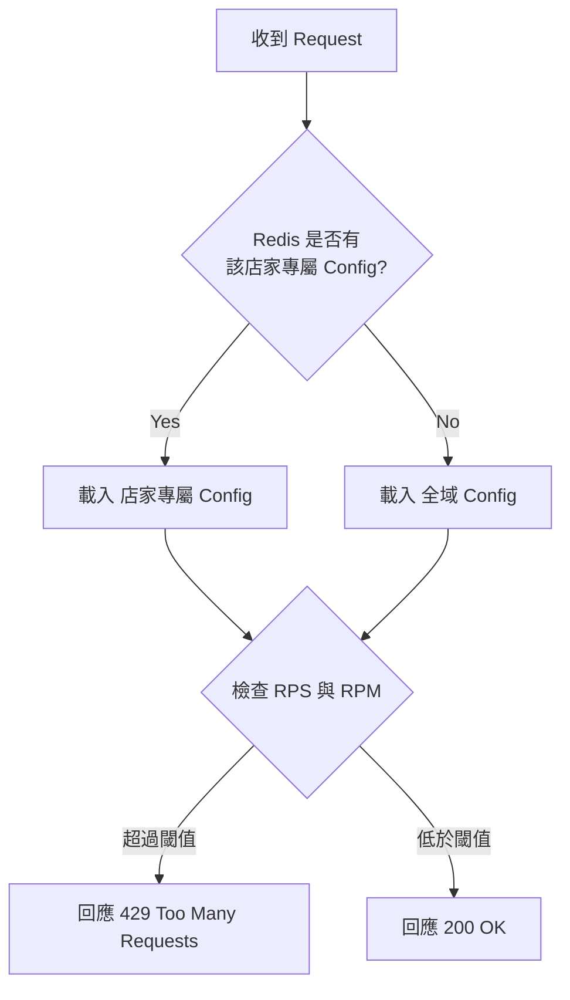

先簡單說一下什麼是 Rate Limit

>　Rate Limit 是一種限制網路流量的策略。它限制了某人在特定時間範圍內重複一個動作的頻率

跟壓力測試有點差異，壓力測試主要都是為了量測系統是否能夠在某個 RPS/RPM(Request Per Second/Request Per Minute) 下正常運作
也會確保把機器打爆之後，將 RPS/RPM 歸零或設為小流量，確認機器是否能夠恢復正常

但是 Rate Limit 的測試就有一些的不同，測試的重點在於**規則落實的精準度**
主要是驗證當流量精準踩在邊界時
- 攔截是否毫秒不差
- 當配置在 Redis 更新後，新規則是否即時生效
- 以及當時間窗口（Window）過去後，系統是否能如期恢復

所以本質上針對業務邏輯的功能測試，只是會需要用到壓力測試的工具來模擬高頻率的動作

有些人的想法或許會單純的認為
「啊就把 RPS/RPM 直接壓爛，看有沒有回 429 就好啦~」
但實際上還是有蠻多的測試點可以做思考

來簡單介紹這一次的 Rate Limit 功能

1. 未設定 RPS/RPM 的店家，都會走全域的 RPS/RPM，全域 Config 是以店家為 key 各自計數 (意思就是 A 的 counter 不會吃到 B)
2. 可以針對店家設定屬於該店家的 RPS/RPM
3. 設定的地方在 Redis，所以預期改動設定會立即套用
4. 當觸發 RPS/RPM 時，會開始回應 429

## 針對功能進行測試的發想

### 測試前提

在發想前，為了避免過於發散，所以會先設一下 outline

1. 全域設定是必然存在的
2. 不需要「順便」測試系統負載，以 Rate Limit 的驗證為優先
3. 假設 Redis 連線正常，不測試 Redis 故障情況，聚焦在 Rate Limit 觸發邏輯本身

不過實務上還是會針對範圍以外的內容進行風險確認，畢竟 Redis 壞掉或者 Config 遺失的風險也還是可能存在的
所以仍然需要確認這種狀態底下，是否會發生哪些問題

接著理解一下整個 Rate Limit 在系統運作的流程，畫出來是這樣



### 開始發想

先簡單暴力的確認全域的 RPS/RPM 可不可以正常運作，這樣做會引發一個思考

> 如何確保被觸發的是 RPS 或 RPM?

自我解答：就是把其中一個數字設定得很大，實際模擬 RPS/RPM 時，確保不會觸發到即可
但又冒出了一個問題

> 如何在「還不確定 Config 是否正常運作」的情況下，驗證 RPS/RPM 設定確實有效？

再次自我解答：那就是先把兩個數字都設得很大，確保小流量不會回應 429，至少我能確認小流量的情況下系統正常運作了
確保 RPS/RPM 皆正常運作之後，再把其中一個數字設定為 1，這樣我手動就能觸發 429 確保 Rate Limit 機制正常運作了

以上思考與自我解答的時間差大約為 0.01 秒：


經過上面的思考之後，我們可以得到以下測試想法

```
A. 全域設定驗證
  1. 全域 RPS 限制是否觸發限制
  2. 全域 RPS 限制是否未觸發限制
  3. 全域 RPM 限制是否觸發限制
  4. 全域 RPM 限制是否未觸發限制
B. 店家設定驗證
  1. 店家專屬 RPS 限制是否觸發限制
  2. 店家專屬 RPS 限制是否未觸發限制
  3. 店家專屬 RPM 限制是否觸發限制
  4. 店家專屬 RPM 限制是否未觸發限制
C. 設定優先權驗證
  1. 當店家有專屬設定時，是否優先使用店家設定而非全域設定
  2. 當店家無專屬設定時，是否正確 fallback 到全域設定
D. 即時更新驗證
  1. 修改 Redis 設定後，是否立即生效（不需重啟服務）
  2. 當實際 call 的 RPS 降低後，系統是否能夠恢復正常
E. 其他
  1. 確保店家專屬設定不會套用在其他店家
  2. 確保全域設定在不同店家是獨立的
```

### 建立測試模型

根據上列的測試想法，就可以開始建立測試模型了

| 序號 | 全域設定 (RPS/RPM) | 店家 A 設定 (RPS/RPM) | 測試流量 (對 A) | 測試流量 (對 B) | 預期結果 | 驗證重點 |
| :--- | :--- | :--- | :--- | :--- | :--- | :--- |
| **01** | 20 / 3600 | 無 | 19 RPS | 0 | **200 OK** | A2, A4 |
| **02** | 20 / 3600 | 無 | 21 RPS | 0 | **429 Refuse** | A1 |
| **03** | **25** / 3600 | 無 | 21 RPS | 0 | **200 OK** | D1, A2, A4 |
| **04** | 25 / **1250** | 無 | 21 RPS | 0 | **429 Refuse** | A3, D1 (21*60=1260 RPM) |
| **05** | 25 / **3600** | **22 / 1500** | 21 RPS | 0 | **200 OK** | B2, B4, A2, A4, D1 |
| **06** | 25 / 3600 | 22 / 1500 | **23 RPS** | 0 | **429 Refuse** | C1, B1, B4 |
| **07** | 25 / 3600 | **25** / 1500 | 23 RPS | 0 | **200 OK** | B4, B2, D1 |
| **08** | 25 / 3600 | 25 / **1080** | 23 RPS | 0 | **429 Refuse** | B3, D1 |
| **09** | 25 / 3600 | 22 / 1080 | **15 RPS** | 0 | **200 OK** | D2, A2, A4, B2, B4 |
| **10** | 25 / 3600 | 22 / 1080 | **0** | **23 RPS** | **200 OK** | E1, A2, A4 |
| **11** | 25 / 3600 | 22 / 1080 | **15 RPS** | 23 RPS | **200 OK** | E2, A2, A4, B2, B4 |
| **12** | 25 / 3600 | **無** | **26 RPS** | 0 | **429 Refuse** | C2, A1 |
| **13** | 25 / 3600 | 無 | **23 RPS** | 0 | **200 OK** | C2, A2 |
| ... |  |  |  |  |  |  |

在列這個實驗矩陣的時候很容易腦子裡的邏輯會打架，在列舉的同時會衍伸很多想法，例如

1. 如果觸發了限制，是觸發 `global config` 還是 `店家專屬 config`，如何控制 Config 達成測試目的
2. 每一個 `測試想法` 是否有 `組合性`，例如 C2 是明顯有組合性的，因為 fallback 回去也要確認 A1, A2 是否運作正常
3. 原本 A1~A4 和 B1~B4 只想寫 `RPS/RPM 是否觸發`，但在閱讀上會很難判斷究竟驗證了什麼樣的東西，所以才拆成現狀
4. 要控制的變因很有多元性，你可以控制你 call 的頻率、全域 Config、店家 Config、call 哪個店家，這很容易讓腦子混亂
5. ...

## 結語

