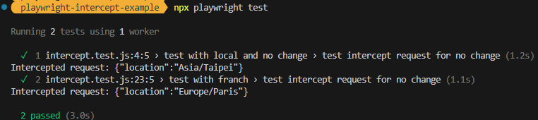

工作上測試遇到了一個情境是測試 Web SDK，主要類似於 GA 的那種監控網頁事件來發送 request 的受測對象
Web SDK 會根據當下使用者的事件觸發順序而產生不同的 request 內容
今天準備了一個可以觸發 request 的 HTML、接收 request 的簡單 Node.js Backend API Server
還有筆記用的 Playwright 攔截 request 範例程式碼

所有程式碼都放在這: [範例程式碼](https://github.com/SQZ777/playwright-intercept-example)

這張圖應該能表達到今天文章範例中的攔截器概念(?)


自動化的執行流程:
1. 啟動 server.js，讓 html 可以透過本地伺服器瀏覽
2. 使用瀏覽器瀏覽 localhost:3000
3. 點擊按鈕觸發 request 發送的動作
4. 攔截 request 驗證 request 被發送的正確性

## 程式碼

~~可能不算程式碼...? 沒有人:可是它裡面有 js~~

此 HTML 會在按下按鈕後擷取當下瀏覽器中的 timezone，將 timezone 夾帶進去 request 發送到 Backend Server
``` HTML
<!DOCTYPE html>
<html lang="en">

<head>
    <meta charset="UTF-8">
    <meta name="viewport" content="width=device-width, initial-scale=1.0">
    <title>Playwright Example</title>
</head>

<body>
    <h1>Playwright Intercept Request Example</h1>
    <button id="sendRequest">Send Request</button>

    <script>
        const timezone = Intl.DateTimeFormat().resolvedOptions().timeZone;
        document.getElementById('sendRequest').addEventListener('click', () => {
            fetch('/api/data', {
                method: 'POST',
                headers: {
                    'Content-Type': 'application/json'
                },
                body: JSON.stringify({ location: timezone })
            })
                .then(response => response.json())
                .then(data => console.log('Response from server:', data))
                .catch(error => console.error('Error:', error));
        });
    </script>
</body>

</html>
```

接收 request 以及讓 HTML 可以被瀏覽

Node.js Server
```
const express = require('express');
const path = require('path');
const app = express();
const port = 3000;

app.use(express.json());

// 提供 public 資料夾中的靜態檔案
app.use(express.static(path.join(__dirname, 'public')));

app.post('/api/data', (req, res) => {
    console.log('Received data:', req.body);
    res.json({ message: 'Data received successfully', receivedData: req.body });
});

// 服務 index.html
app.get('/', (req, res) => {
    res.sendFile(path.join(__dirname, 'index.html'));
});

app.listen(port, () => {
    console.log(`Server is running on http://localhost:${port}`);
});
```

## Playwright 攔截範例

先寫一個不改變瀏覽器 timezone 的案例，瀏覽器會依照使用者當前的機器設定來設定 timezone
我目前待在台灣，所以 timezone id 會是 `Asia/Taipei`
```javascript
const { test, expect } = require('@playwright/test');

test.describe('test with local and no change', () => {
    test('test intercept request for no change', async ({ page }) => {
        await page.route('**/api/data', (route, request) => {
            console.log('Intercepted request:', request.postData());
            const postData = JSON.parse(request.postData());
            expect(postData.location).toBe('Asia/Taipei');
            route.continue();
        });
    
        await page.goto('http://localhost:3000');
        await page.click('#sendRequest');
    
        // 讓時間留給網頁處理請求
        await page.waitForTimeout(1000);
    });
});
```

再寫一個改變瀏覽器 timezone 的案例，這個案例會先將 timezone 改為 `Europe/Paris`，再執行瀏覽 HTML 的動作

```javascript
test.describe('test with franch', () => {
    test.use({ timezoneId: 'Europe/Paris' });
    test('test intercept request for no change', async ({ page }) => {
        await page.route('**/api/data', (route, request) => {
            console.log('Intercepted request:', request.postData());
            const postData = JSON.parse(request.postData());
            expect(postData.location).toBe('Europe/Paris');
            route.continue();
        });
    
        await page.goto('http://localhost:3000');
        await page.click('#sendRequest');
    
        // 讓時間留給網頁處理請求
        await page.waitForTimeout(1000);
    });
});
```

兩個案例執行完之後在 console 中可以見到以下結果



## 額外筆記

因為這一種會持續監聽瀏覽器事件的 Web SDK，是不會有 request 停止的一刻，所以選擇使用的是 `page.waitForTimeout(1000)`
而非 `page.waitForLoadState('networkidle')`