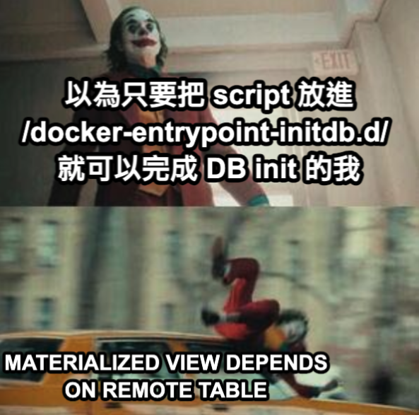

遇到這個 Issue 是因為測試上的需求，情境是要做 API Automation
而 SUT(System Under Test) 的 API 相依於 Postgres 中的某一個 Materialized View
又剛好，這個 Materialized View 會用到 remote table 的資料
再剛好，這個 remote table 也是你要做 init DB 的對象（在同一個 image）
執行 REFRESH MATERIALIZED VIEW 的時候發生的問題
所以就發生了這個問題，錯誤訊息如下

```shell
2024-06-18 00:51:17.451 UTC [68] ERROR:  could not connect to server "test1_db"
2024-06-18 00:51:17.451 UTC [68] DETAIL:  connection to server at "localhost" (::1), port 5432 failed: Connection refused
		Is the server running on that host and accepting TCP/IP connections?
	connection to server at "localhost" (127.0.0.1), port 5432 failed: Connection refused
		Is the server running on that host and accepting TCP/IP connections?
2024-06-18 00:51:17.451 UTC [68] STATEMENT:  REFRESH MATERIALIZED VIEW test2_db_schema.test2_mv
ERROR:  could not connect to server "test1_db"
DETAIL:  connection to server at "localhost" (::1), port 5432 failed: Connection refused
	Is the server running on that host and accepting TCP/IP connections?
connection to server at "localhost" (127.0.0.1), port 5432 failed: Connection refused
	Is the server running on that host and accepting TCP/IP connections?
```

## 這次 issue 的相關檔案

### dockerfile:
```dockerfile
FROM postgres:14-alpine

ENV POSTGRES_USER=postgres
ENV POSTGRES_PASSWORD=12345
ENV POSTGRES_DB=test1

COPY test1.sql /test1.sql
COPY test2.sql /test2.sql

COPY init.sh /docker-entrypoint-initdb.d/init.sh
```

### init.sh:
```shell
psql -U postgres -c "CREATE DATABASE test2;"

psql -U postgres -d test1 -a -f /test1.sql
psql -U postgres -d test2 -a -f /test2.sql
psql -U postgres -d test2 -c "REFRESH MATERIALIZED VIEW test2_db_schema.test2_mv"
```

### test1.sql:
```sql
CREATE SCHEMA test1_db_schema AUTHORIZATION postgres;

-- test1_db_schema.test1_table definition

-- Drop table

-- DROP TABLE test1_db_schema.test1_table;

CREATE TABLE test1_db_schema.test1_table (
	id varchar(10) NOT NULL,
	another_column varchar(50) NOT NULL
)
```

### test2.sql:
```sql
CREATE SCHEMA test2_db_schema AUTHORIZATION postgres;

CREATE EXTENSION postgres_fdw;

CREATE SERVER test1_db
        FOREIGN DATA WRAPPER postgres_fdw
        OPTIONS (host 'localhost', port '5432', dbname 'test1');

CREATE USER MAPPING FOR postgres
SERVER test1_db
OPTIONS (user 'postgres', password '12345');

-- test2_db_schema.test1_table definition

-- Drop table

-- DROP FOREIGN TABLE test2_db_schema.test1_table;

CREATE FOREIGN TABLE test2_db_schema.test1_table (
	id varchar(10) NOT NULL,
	another_column varchar(50) NOT NULL
)
SERVER test1_db
OPTIONS (schema_name 'test1_db_schema', table_name 'test1_table');

-- Permissions

ALTER TABLE test2_db_schema.test1_table OWNER TO postgres;
GRANT ALL ON TABLE test2_db_schema.test1_table TO postgres;

CREATE MATERIALIZED VIEW test2_db_schema.test2_mv
TABLESPACE pg_default
AS SELECT t.id,
    t.another_column
   FROM test2_db_schema.test1_table t
WITH NO DATA;

-- View indexes:
CREATE UNIQUE INDEX uix_test2_mv ON test2_db_schema.test2_mv USING btree (cupid_id, outer_id);

-- Permissions
ALTER TABLE test2_db_schema.test2_mv OWNER TO postgres;
GRANT ALL ON TABLE test2_db_schema.test2_mv TO postgres;
```

## 解法

根據 [postgres 在 github 上的 dockerfile](https://github.com/docker-library/postgres/blob/master/Dockerfile-alpine.template#L216)，可以注意到
1. 原始 postgres 的 docker-entrypoint.sh 放置於 `/usr/local/bin`
2. 你的 dockerfile 中，位於 `/docker-entrypoint-initdb.d/` 的 shell script，會早於 postgres 啟動的時間點

### 步驟
1. init.sh 中啟動 postgres，並確認 postgres 啟動後再執行我們的原本要執行的 script，並讓 image 保持啟動狀態
2. dockerfile 改為 `RUN init.sh`，而非原本將 init.sh 放進 `/docker-entrypoint-initdb.d/` 的方式

### 改變後的 init.sh：
```shell
#!/bin/bash
echo "Starting PostgreSQL..."

/usr/local/bin/docker-entrypoint.sh postgres & # 將 postgres 啟動

until pg_isready -h localhost -p 5432; do # 檢查 postgres 啟動狀態
  echo "Waiting for PostgreSQL to start..."
  sleep 1
done

# psql -U postgres -c "CREATE DATABASE test1;"
psql -U postgres -c "CREATE DATABASE test2;"


psql -U postgres -d test1 -a -f /test1.sql
psql -U postgres -d test2 -a -f /test2.sql
psql -U postgres -d test2 -c "REFRESH MATERIALIZED VIEW test2_db_schema.test2_mv"

tail -f /dev/null # 讓 container 保持運作狀態
```

### 改變後的 dockerfile:
```dockerfile
FROM postgres:14-alpine

ENV POSTGRES_USER=postgres
ENV POSTGRES_PASSWORD=12345
ENV POSTGRES_DB=test1

COPY test1.sql /test1.sql
COPY test2.sql /test2.sql

# COPY init.sh /docker-entrypoint-initdb.d/init.sh
COPY init.sh /init.sh

RUN chmod +x /init.sh

CMD ["/init.sh"]
```

## 感想

我真的沒想到會遇到這種問題，一開始單純只是想要快樂 init DB schema 而已，所以就單純放在 `/docker-entrypoint-initdb.d/` 裡面
這個過程讓我學到 Dockerhub 上的 image 中，他的 Dockerfile 是如何被執行的
以及我們自己放在 `/docker-entrypoint-initdb.d/` 裡面的 shell script 的執行順序

不過我不知道我這個解法到底是對的還是錯的 XD
如果有更好的解法歡迎告訴我
感謝
