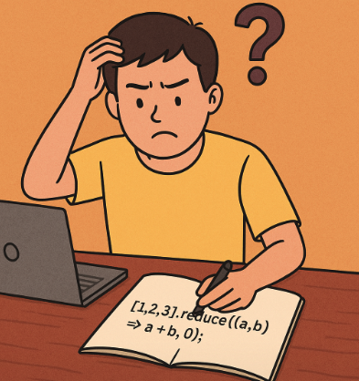

今天寫 JavaScript 用 CodeWars 暖暖手，年底到了，懂的都懂（？）
先從 8kyu 開始複習一下語法，平常寫自動化真的用不到太多原生函式，大多都是在處理測試邏輯和測試資料的整理，不然就是閱讀 RD/QA 們寫的 code

## 今天的題目：How good are you really?



總之，今天遇到的題目是「How good are you really?」，大意就是
你會拿到一個陣列，裡面是同學們的考試分數，計算平均分數，並和你的分數比較
如果你大於平均 return `true`，否則 return `false`。

## 我的第一個解法

寫這種題目其實我更熟悉使用 C# 的 lib，只要把 array 透過 linq 做 `[].Average()` 再用判斷式處理就結束了
但是 JavaScript... 我沒有這麼熟悉他的原生 lib（畢竟寫自動化會用到的就那幾個 XD）

於是簡單寫的答案是這樣：

```javascript
function betterThanAverage(classPoints, yourPoints) {
  let scoreSum = 0;
  for(i = 0; i< classPoints.length; i++){
    scoreSum += classPoints[i];
  }
  return yourPoints > (scoreSum/classPoints.length);
}
```

送出也成功解了！

## 別人的解法讓我大開眼界

看了別人的答案，如下：

```javascript
function betterThanAverage(classPoints, yourPoints) {
  return yourPoints > classPoints.reduce((a, b) => a + b, 0) / classPoints.length; 
}
```

誒？原來有 `reduce` 這種函式啊...

但我怎麼想都想不通，我英文太爛了，`reduce` 不是「減少」的意思嗎？到底怎麼回事？

## 偉哉時代的巨人，煩請 AI 老師救援

偉哉 AI！下個 prompt 請他解釋才知道，喔！原來是這樣

我的 prompt：

```text
把我當五歲小孩
解釋為什麼裡面的 reduce 方法要叫 reduce, reduce 英文不是「減少」的意思嗎
javascript
[1,2,3].reduce((a,b) => a + b, 0);
```

AI 回應：

```text
好的小朋友！我來解釋給你聽～

reduce 確實有「減少」的意思，但在程式設計裡，它的意思是「把很多東西變成一個東西」！

想像一下：
🍎🍎🍎 (很多蘋果) → 🥧 (一個蘋果派)

reduce 就是這樣！它把一個陣列（很多數字）變成一個結果（一個數字）

[1, 2, 3] → 6

步驟是這樣的：
1. 開始：a = 0（起始值）
2. 第一輪：a = 0, b = 1 → a + b = 1
3. 第二輪：a = 1, b = 2 → a + b = 3  
4. 第三輪：a = 3, b = 3 → a + b = 6
5. 結果：6

所以 reduce 的「減少」是指：
- 減少陣列的「複雜度」
- 把「多個」元素變成「一個」結果
- 把「大的資料結構」縮減成「小的結果」

就像把很多積木組裝成一個玩具一樣！
```

## 總結

原來 `reduce` 在程式設計中的「減少」，指的是把多個元素「縮減」成一個結果！不是數量上的減少，而是複雜度的簡化。

這次的學習讓我想起程式設計中很多名詞的含義，往往跟我們日常理解的意思有些微妙的差異
繼續暖手，Keep Learning!

我真的蠻喜歡 CodeWars 提交後可以看到很多人的 submit，一來自己透過 for 迴圈達成了複習的目的，二來又可以根據別人的答案學習到不同的撰寫方法，不懂的地方問 AI，讓我更熟悉 JavaScript 的語法，在複習上更有效率了！覺得愉悅
